# 异步报告任务系统

## 技术设计文档

### 阶段二 – Async Core

### 版本 0.1（框架草案）

------

# 1. 背景说明

## 1.1 当前架构概述

当前系统在阶段一采用“同步调用模型”完成报告生成流程：

```
Client → API → Application → SummaryService.generate() → 返回报告结果
```

在该模型中，报告生成逻辑直接在 API 请求线程内执行。API 在调用 SummaryService 生成报告后，等待结果返回，再将结果响应给客户端。

这种方式在功能验证阶段可以快速闭环，但其本质仍属于“函数式调用模型”，不具备任务生命周期管理能力。

------

## 1.2 当前架构存在的系统性问题

虽然阶段一实现了功能闭环，但从系统架构角度分析，当前同步模型存在以下核心问题：

### （1）执行模型耦合问题

API 层与报告生成逻辑强耦合：

- API 请求必须等待报告生成完成
- 业务执行与请求生命周期绑定
- 无法独立控制任务执行节奏

这导致系统无法实现真正的异步控制能力。

------

### （2）生命周期缺失问题

当前架构中不存在“任务实体”这一概念：

- 无任务状态（进行中 / 完成 / 失败）
- 无执行记录
- 无错误持久化
- 无执行次数统计

系统无法描述“任务正在生成”的状态，只能返回成功或异常。

------

### （3）扩展性受限问题

在同步模型下：

- 无法平滑接入队列系统（如 SQS）
- 无法支持多 Worker 扩展
- 无法实现失败重试机制
- 无法支持未来分布式部署

系统结构天然不适合演进为云端架构。

------

### （4）失败隔离能力不足

若报告生成过程中发生异常：

- 异常直接传播至 API
- 无法记录失败状态
- 无法控制重试策略
- 无法进行降级处理

这会导致系统稳定性依赖于单次执行成功率。

------

### （5）系统职责边界不清晰

当前架构中：

- API 负责触发执行
- Application 负责业务逻辑
- 执行行为与任务控制混在一起

缺少明确的“任务控制层”。

在企业级系统中，执行控制（调度）与业务逻辑必须解耦。

------

## 1.3 本阶段的必要性

为了使系统具备工程化能力，需要从“同步函数模型”升级为“异步任务模型”，实现：

- 执行与请求生命周期解耦
- 明确的任务状态机
- 失败可控与可重试机制
- 支持未来云端队列迁移

阶段二的核心目标，不是增加功能，而是升级系统执行模型。

------

# 2. 设计目标

## 2.1 本阶段目标（Goals）

本阶段的目标是将“报告生成”从同步调用升级为标准异步任务模式，使系统具备最小可用的任务系统能力（Async Core）：

1. **异步化执行模型**
   - API 接口只负责“提交任务”，不得同步等待报告生成完成。
   - 报告生成在后台执行，与请求生命周期解耦。
2. **任务生命周期可管理**
   - 引入 Task 领域模型与任务状态机。
   - 任务至少具备：创建、执行中、完成、失败 四种状态表达。
3. **状态可查询、结果可获取**
   - 客户端能通过 task_id 查询任务状态。
   - 当任务完成后，可获取生成结果；失败时可获取失败原因（最小字段）。
4. **失败可控与可重试（最小集）**
   - 任务失败必须进入可追踪状态，而不是直接丢失。
   - 任务支持最小重试字段（retry_count / max_retries），并能形成清晰的失败收敛行为（达到上限进入 FAILED）。
5. **保持 Clean Architecture 边界不被破坏**
   - Domain 不依赖外部框架（FastAPI / 线程 / 队列）。
   - API 不包含业务规则与状态流转规则。
   - 执行机制（Worker/队列）通过抽象隔离，可替换。
6. **为未来 AWS 队列化迁移预留接口**
   - 引入 TaskExecutor 抽象：本地使用 LocalExecutor，实现可替换到 SQS 执行器而无需重写业务逻辑。

------

## 2.2 非目标范围（Non-Goals）

为避免过度设计，本阶段明确不做以下内容：

- 不构建通用任务平台（仅服务于“报告生成”这一异步场景）。
- 不实现任务优先级、任务依赖图、任务编排等复杂调度能力。
- 不实现分布式一致性协议与强一致事务。
- 不引入外部 MQ 中间件（SQS / RabbitMQ / Celery 等），仅在本地实现可替换的执行器。
- 不做完整的观测平台（只做最小日志与关键指标占位）。

------

## 2.3 交付标准（Done Criteria）

本阶段完成需要满足以下可验收条件：

1. **任务提交**：POST /tasks/report 返回 task_id，API 不等待结果。
2. **状态查询**：GET /tasks/{task_id} 可返回 status（PENDING/RUNNING/DONE/FAILED）。
3. **结果获取**：DONE 状态时返回 result；FAILED 状态时返回 error（最小信息）。
4. **状态流转完整**：至少覆盖 PENDING→RUNNING→DONE 与异常进入 FAILED；包含 retry 字段与失败收敛。
5. **分层不破坏**：Domain 无框架依赖，API 无业务规则，执行机制可替换。

------

# 3. 系统总体架构设计

本章节描述阶段二引入异步任务系统后的整体结构变化，以及各层之间的职责边界。

------

## 3.1 高层逻辑架构

### 3.1.1 阶段一（同步模型）

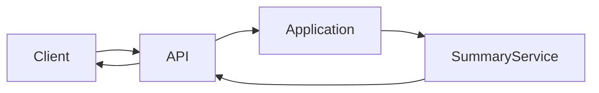

特征：

- 执行发生在请求线程内
- 无任务实体
- 无状态管理

------

### 3.1.2 阶段二（异步任务模型）

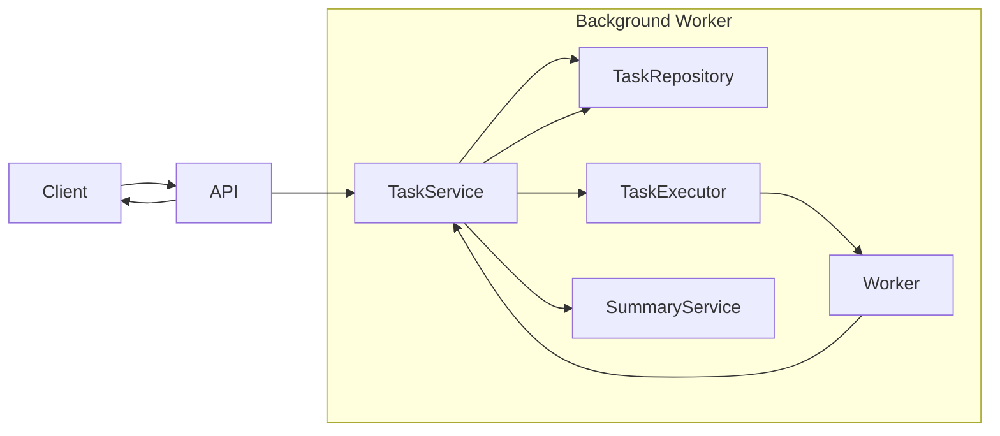

核心变化：

- API 不再直接调用 SummaryService
- 执行从请求线程迁移到后台 Worker
- Task 成为执行控制中心

------

## 3.2 分层依赖结构图

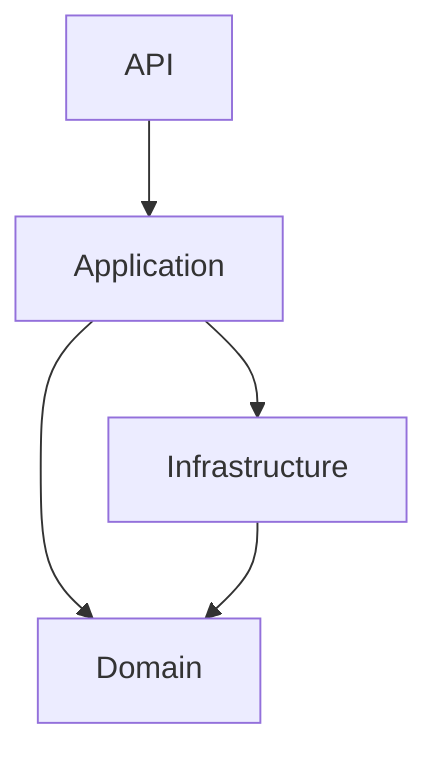

依赖原则：

- 依赖只能向内
- Domain 不依赖任何外层
- Infrastructure 不得包含业务规则

------

## 3.3 提交流程时序图（Submit Flow）

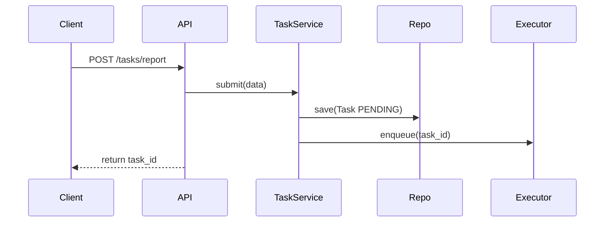

关键点：

- API 不等待执行结果
- 任务创建与入队原子完成

------

## 3.4 执行流程时序图（Process Flow）

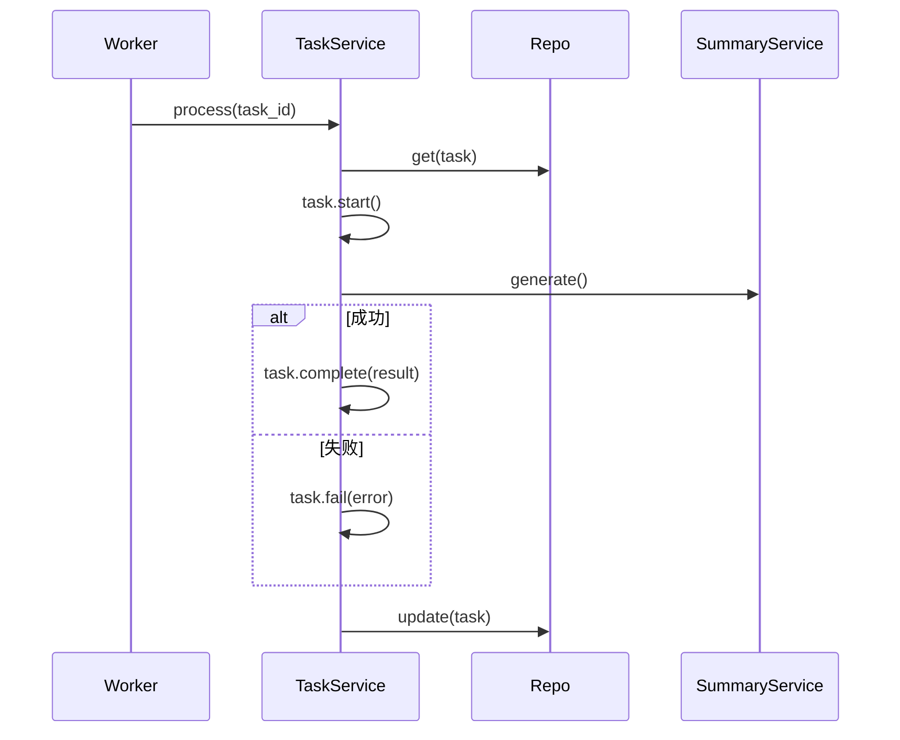

关键点：

- 状态流转由 Domain 控制
- 失败不会丢失

------

## 3.5 架构演进对比图

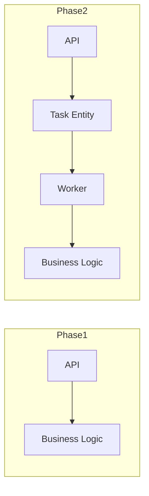

本质变化：

1. 执行权从 API 转移到 Worker
2. 引入 Task 状态机作为控制核心
3. 系统从“函数调用模型”升级为“任务调度模型”

------

# 4. 领域模型设计（Domain）

本章节定义阶段二的核心：Task 实体与严格状态机模型。

本设计采用“可生产演进”的状态机，而非教学简化版本。

------

## 4.1 Task 实体结构

### 4.1.1 字段定义

| 字段        | 类型           | 说明             |
| ----------- | -------------- | ---------------- |
| id          | str            | 任务唯一标识     |
| status      | TaskStatus     | 当前状态         |
| retry_count | int            | 已重试次数       |
| max_retries | int            | 最大允许重试次数 |
| result      | Optional[dict] | 成功结果         |
| error       | Optional[str]  | 失败原因         |
| created_at  | datetime       | 创建时间         |
| updated_at  | datetime       | 更新时间         |

设计原则：

- Task 是“状态容器”，不是执行器。
- 所有状态变更必须通过实体方法完成。
- 外部禁止直接修改 status 字段。

------

## 4.2 状态定义

### 4.2.1 状态枚举

- PENDING（待执行）
- RUNNING（执行中）
- DONE（已完成）
- FAILED（最终失败）

说明：

- FAILED 表示“不可再重试的终态”。
- retry 未达上限时不会进入 FAILED，而是回到 PENDING。

------

## 4.3 状态流转图（企业级版本）

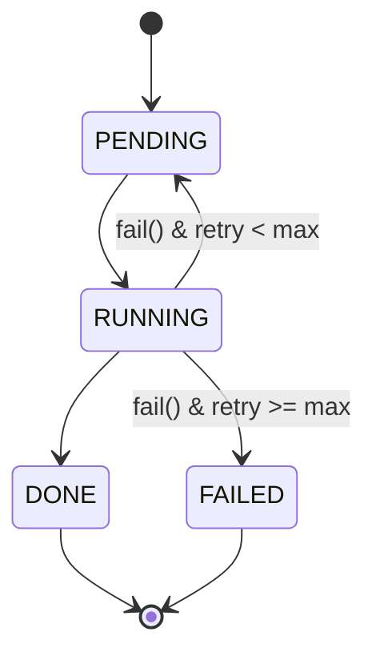

------

## 4.4 状态流转规则（强约束）

### 4.4.1 start()

前置条件：

- 当前状态必须为 PENDING

行为：

- status → RUNNING
- updated_at 更新

非法调用：

- 若状态非 PENDING，抛出异常

------

### 4.4.2 complete(result)

前置条件：

- 当前状态必须为 RUNNING

行为：

- status → DONE
- 保存 result
- updated_at 更新

非法调用：

- 若状态非 RUNNING，抛出异常

------

### 4.4.3 fail(error)

前置条件：

- 当前状态必须为 RUNNING

行为：

- retry_count += 1
- 记录 error

分支逻辑：

- 若 retry_count < max_retries
  - status → PENDING
- 若 retry_count >= max_retries
  - status → FAILED

updated_at 更新

非法调用：

- 若状态非 RUNNING，抛出异常

------

## 4.5 不可逆状态约束

- DONE 为终态
- FAILED 为终态
- 终态不可再调用 start() / complete() / fail()

违反将抛出异常。

------

## 4.6 企业级设计考虑

### 4.6.1 为什么不允许外部直接改状态？

避免：

- 并发覆盖
- 非法跳跃状态
- 状态与 retry 不一致

状态机必须封装在 Domain 内。

------

### 4.6.2 为什么 retry 回到 PENDING？

因为：

- 任务重新进入队列
- 允许执行器再次调度
- 保持执行模型一致

------

### 4.6.3 为什么 FAILED 是终态？

表示：

- 任务已经穷尽重试
- 需要人工干预或上层处理
- 不允许自动再执行

------

## 4.7 状态机的系统意义

阶段二的核心升级在于：

- 将“函数执行”转变为“状态驱动执行”。
- 将“成功/异常返回”转变为“任务生命周期管理”。
- 为未来分布式执行打下基础。

至此，系统已具备最小企业级任务状态控制能力。

------

# 5. 应用层设计（Application）

本章节定义 TaskService 的职责边界、方法结构以及其与 Domain、Repository、Executor 之间的协作关系。

在阶段二中，Application 层是“任务编排核心”，负责驱动状态流转与业务执行，但不拥有执行机制本身。

------

## 5.1 设计目标

Application 层必须实现以下能力：

1. 任务创建与初始化。
2. 驱动 Task 状态机合法流转。
3. 调用业务服务（SummaryService）。
4. 协调 Repository 与 Executor。
5. 对外提供清晰的任务操作接口。

同时必须遵守以下约束：

- 不直接创建线程。
- 不直接操作队列实现。
- 不修改 Task.status 字段（必须通过 Domain 方法）。
- 不编写数据库底层逻辑。

------

## 5.2 TaskService 结构定义

### 5.2.1 对外接口

TaskService 对外暴露三个核心方法：

- submit(data)
- process(task_id)
- get(task_id)

调用来源：

- submit：由 API 层调用。
- process：由 Executor（Worker）调用。
- get：由 API 查询接口调用。

------

## 5.3 submit() 设计

### 5.3.1 职责说明

submit() 负责：

1. 创建 Task 实例（初始状态 PENDING）。
2. 持久化任务到 Repository。
3. 将任务加入执行器队列。
4. 返回 task_id。

### 5.3.2 执行流程图

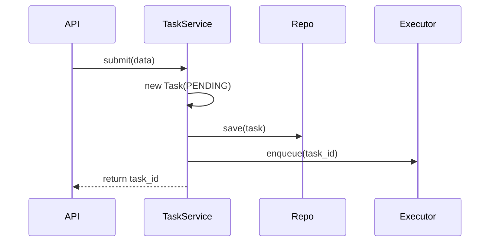

### 5.3.3 关键设计约束

- submit() 不允许调用 SummaryService.generate()。
- submit() 不允许等待执行完成。
- save 与 enqueue 必须逻辑连续，避免任务丢失。

------

## 5.4 process() 设计

### 5.4.1 职责说明

process(task_id) 负责：

1. 加载 Task。
2. 驱动状态进入 RUNNING。
3. 调用 SummaryService.generate()。
4. 根据执行结果更新状态。
5. 持久化状态变化。

### 5.4.2 执行流程图

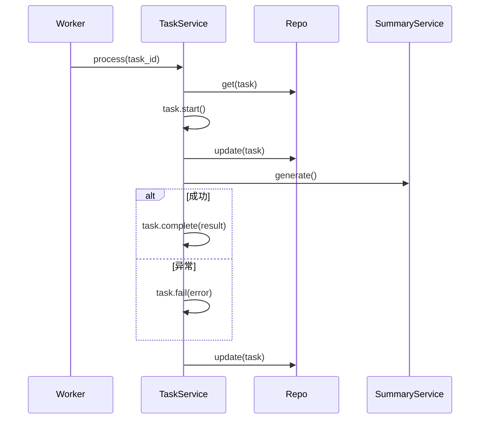

### 5.4.3 关键原则

- 状态流转必须通过 Domain 方法。
- 每次状态变化必须持久化。
- 失败必须通过 fail() 方法处理。
- 不允许跳过 RUNNING 直接进入 DONE。

------

## 5.5 get() 设计

### 5.5.1 职责说明

get(task_id) 负责：

- 查询任务当前状态。
- 返回状态与结果字段。

### 5.5.2 设计约束

- 不执行任何业务逻辑。
- 不修改任务状态。
- 不触发执行行为。

------

## 5.6 异常处理边界

Application 层可能遇到的异常来源：

1. Repository 异常。
2. Domain 非法状态异常。
3. SummaryService 执行异常。

处理策略：

- Domain 非法状态异常：视为编排错误，直接抛出。
- SummaryService 异常：通过 task.fail() 控制流转。
- Repository 异常：本阶段直接抛出，由上层统一处理。

------

## 5.7 执行权与控制权分离

阶段二明确区分：

- 控制权：由 API 调用 submit()。
- 执行权：由 Worker 调用 process()。

Application 层不关心线程来源，只区分“提交入口”与“执行入口”。

------

## 5.8 本章小结

Application 层是异步系统的编排中心：

- 它驱动状态机。
- 它协调业务逻辑。
- 它维护任务生命周期。

但它不负责：

- 并发一致性实现。
- 执行调度策略。
- 存储底层实现。

至此，阶段二的任务编排逻辑已完整定义。

------

# 6. 执行器架构设计（Executor）

本章节定义“任务执行机制”的抽象方式，以及本地版本的实现方案。

阶段二的目标不是实现分布式队列，而是建立“可替换的执行机制抽象”。

------

## 6.1 设计目标

Executor 层负责：

1. 接收 task_id。
2. 触发 TaskService.process()。
3. 将执行行为与 Application 层解耦。

Executor 层不得：

- 包含业务逻辑。
- 修改 Task 状态。
- 直接访问 Domain 内部字段。

------

## 6.2 Executor 抽象接口设计

定义抽象接口：

```
enqueue(task_id: str)
```

说明：

- Application 只依赖该接口。
- 不关心具体实现是线程、队列还是云服务。

设计原则：

- Application 负责“何时执行”。
- Executor 负责“如何执行”。

------

## 6.3 本地执行器设计（LocalExecutor）

阶段二采用：

- 内存队列（queue.Queue）
- 后台线程（daemon worker）

### 6.3.1 结构示意图

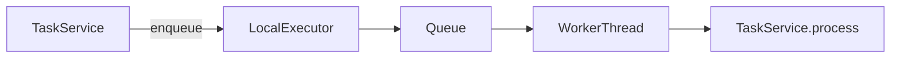

说明：

- TaskService 只调用 enqueue。
- WorkerThread 持续从队列中取 task_id。
- 执行 process()。

------

### 6.3.2 本地执行流程图

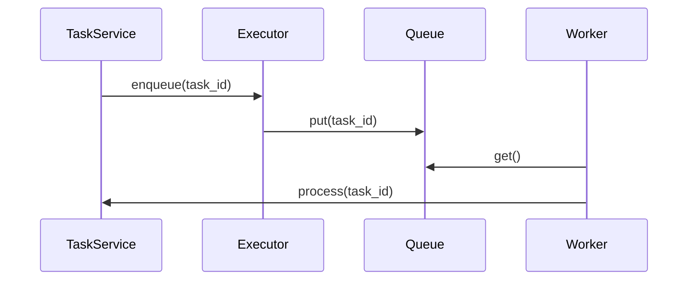

------

## 6.4 单 Worker 假设（阶段二约束）

阶段二明确采用：

- 单进程
- 单 Worker 线程

原因：

- 简化并发控制问题。
- 避免重复执行风险。
- 将并发一致性问题延后至 AWS 阶段。

该约束必须在文档中明确。

------

## 6.5 未来 SQS 执行器设计预留

在 AWS 阶段，Executor 将被替换为：

- SQSTaskExecutor
- Lambda Worker

### 6.5.1 云端执行架构示意图

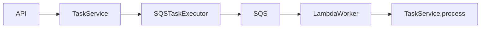

说明：

- Application 不发生改变。
- 仅替换 Executor 实现。
- process() 逻辑保持不变。

------

## 6.6 执行器抽象的系统意义

引入 Executor 抽象的核心意义在于：

1. 隔离“调度机制”与“业务编排”。
2. 保证 Application 层纯粹。
3. 支持执行机制平滑替换。
4. 为未来分布式扩展预留边界。

阶段二的 Executor 设计，已经具备向生产级队列系统演进的结构基础。

------

# 7. 仓储层设计（Repository）

本章节定义 TaskRepository 的抽象边界、本地实现方式，以及未来迁移至 DynamoDB 的映射策略。

Repository 层负责“任务状态的持久化”，但不负责：

- 状态流转规则
- 业务逻辑
- 执行调度

------

## 7.1 设计目标

Repository 层必须满足：

1. 能保存 Task 实体。
2. 能根据 task_id 查询 Task。
3. 能更新 Task 状态。
4. 为未来条件更新（并发控制）预留接口扩展能力。

------

## 7.2 TaskRepository 抽象接口

抽象接口定义：

```
save(task: Task)
get(task_id: str) -> Task
update(task: Task)
```

说明：

- save()：仅用于新任务创建。
- update()：用于状态变化后的持久化。
- get()：用于加载任务当前状态。

约束：

- Repository 不允许修改 Task 内部字段。
- Repository 不包含状态机逻辑。

------

## 7.3 本地实现（InMemoryTaskRepository）

阶段二本地版本采用：

- 内存字典存储
- key = task_id
- value = Task 对象

### 7.3.1 结构示意

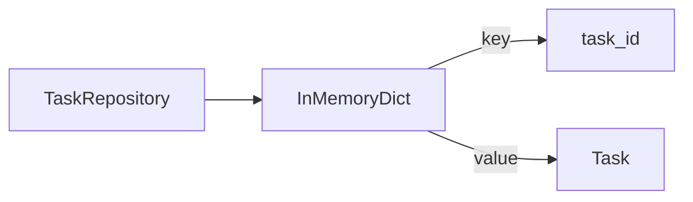

说明：

- 不做并发锁控制（单 Worker 假设）。
- 不做持久化存储（仅用于阶段验证）。

------

## 7.4 数据一致性约束（当前阶段）

阶段二假设：

- 单进程
- 单 Worker

因此：

- 不实现乐观锁
- 不实现版本号控制
- 不实现事务

但必须在设计上明确：

“update() 在未来必须支持条件更新能力”。

------

## 7.5 未来 DynamoDB 映射策略

在阶段四迁移至 AWS 时，Repository 将映射至 DynamoDB。

### 7.5.1 单表结构示意

| PK             | SK   | 类型 | 说明         |
| -------------- | ---- | ---- | ------------ |
| TASK#<task_id> | META | Task | 任务状态记录 |

### 7.5.2 条件更新示意

在并发环境下，更新 RUNNING 状态必须使用条件表达式：

```
ConditionExpression:
    status = :expected_status
```

例如：

- 仅当 status = PENDING 时，才允许更新为 RUNNING。

该设计用于避免：

- 多 Worker 重复执行。
- 状态覆盖。

------

## 7.6 Repository 层的系统意义

引入 Repository 抽象的核心意义：

1. 隔离存储实现。
2. 支持从内存 → DynamoDB 平滑迁移。
3. 将一致性控制下沉至存储层。
4. 保证 Domain 与存储解耦。

阶段二的 Repository 设计为未来分布式一致性控制预留了结构空间。

------

# 8. 失败与重试策略设计

本章节定义任务执行失败后的处理逻辑、重试分层策略、失败收敛机制以及未来演进方向。

阶段二目标：

- 建立“可预测”的失败行为
- 明确自动恢复边界
- 保证任务最终收敛

本阶段不追求复杂容灾机制，但必须具备工程级结构。

------

## 8.1 失败类型分层

为避免混乱，必须区分不同类型的失败：

| 失败类型     | 示例                | 是否自动重试 | 处理方式               |
| ------------ | ------------------- | ------------ | ---------------------- |
| 业务执行异常 | generate() 抛出异常 | 是           | 进入 retry 流程        |
| 外部依赖异常 | 未来 LLM/网络错误   | 是           | 进入 retry 流程        |
| 非法状态异常 | 非法状态转换        | 否           | 抛出异常，视为系统缺陷 |
| 存储异常     | Repository 写失败   | 否（阶段二） | 直接抛出               |

重要原则：

- 仅对“可恢复异常”进行自动重试。
- 逻辑错误不得自动重试。

------

## 8.2 重试模型（Retry Model）

### 8.2.1 核心字段

- retry_count
- max_retries

retry_count 只允许在 fail() 中递增。

------

### 8.2.2 重试流转规则

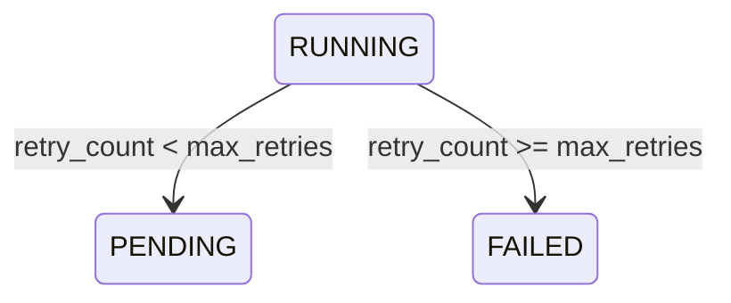

规则解释：

- 每次 fail() 调用都会增加 retry_count。
- 未达到上限 → 回到 PENDING，等待再次调度。
- 达到上限 → 进入 FAILED（终态）。

------

## 8.3 重试执行策略（阶段二实现）

阶段二采用：

- 立即重新入队（无延迟）
- 单 Worker 执行
- 不实现指数退避
- 不实现定时调度

原因：

- 当前重点是验证状态机行为
- 保持执行路径可控
- 避免调度复杂度干扰架构验证

------

## 8.4 失败收敛机制

FAILED 状态必须满足：

- retry_count >= max_retries
- 不允许再次 start()
- 不允许自动回到 PENDING

FAILED 表示：

- 自动恢复能力已耗尽
- 需要人工介入或上层逻辑处理

这是“失败收敛原则”。

系统必须保证：

> 所有任务最终必然进入 DONE 或 FAILED。

不得存在“无限重试循环”。

------

## 8.5 幂等性要求

在异步系统中，必须考虑重复执行风险。

可能场景：

- Worker 重启
- 重复消息
- 手动触发 process()

幂等性要求：

- DONE 状态不可再执行 generate()
- FAILED 状态不可再回退
- 非法状态转换必须抛出异常

通过：

- 严格状态机约束
- 终态不可逆规则

保证系统稳定性。

------

## 8.6 日志与可追踪要求

每次执行失败必须记录：

- task_id
- 当前状态
- retry_count
- error 内容
- 时间戳

日志用途：

- 排查失败原因
- 分析重试频率
- 为未来监控系统提供数据

阶段二仅保证日志结构明确，不实现完整监控系统。

------

## 8.7 未来演进方向（阶段四预留）

在 AWS 环境中可升级为：

- 指数退避策略
- 延迟队列（SQS Delay）
- 死信队列（DLQ）
- 最大执行时长控制
- 自动告警机制

阶段二通过：

- retry_count
- max_retries
- 状态机封装

为这些能力预留结构。

------

## 8.8 本章小结

阶段二的失败与重试策略具备以下特征：

- 可预测
- 可收敛
- 可追踪
- 可演进

通过状态机与 retry 控制，实现最小企业级容错能力。

------

# 9. 并发与一致性设计

本章节说明当前阶段的并发假设，以及未来在分布式环境下的一致性控制策略。

阶段二的目标不是彻底解决分布式并发问题，而是：

- 明确问题存在
- 在架构上预留解决空间

------

## 9.1 当前阶段并发假设

阶段二运行环境假设：

- 单进程
- 单 Worker 线程
- 无多实例部署

在该假设下：

- 同一时间仅有一个执行流调用 process()
- 不存在多 Worker 抢占同一 task_id 的情况

因此：

- 不实现锁机制
- 不实现版本号控制
- 不实现数据库条件更新

这是一个“受控简化环境”。

------

## 9.2 潜在并发问题分析

在多 Worker 或多实例环境下，可能出现以下问题：

### 9.2.1 重复执行问题

两个 Worker 同时读取同一个 PENDING 状态的 Task：

1. Worker A 读取状态 = PENDING
2. Worker B 读取状态 = PENDING
3. A 与 B 同时调用 start()
4. 两个执行流同时生成报告

结果：

- 重复计算
- 资源浪费
- 结果覆盖

------

### 9.2.2 状态覆盖问题（Lost Update）

若两个 Worker 并发执行：

- A 更新为 DONE
- B 更新为 FAILED

最终结果取决于最后一次写入。

这会导致：

- 状态不一致
- 结果丢失

------

## 9.3 一致性分层思维

需要区分三种层级：

| 层级        | 负责内容           |
| ----------- | ------------------ |
| Domain      | 合法状态流转       |
| Application | 执行流程控制       |
| Repository  | 原子更新与并发控制 |

重要认知：

状态机 ≠ 并发控制。

状态机只保证“逻辑合法性”。

并发一致性必须由存储层保证。

------

## 9.4 未来分布式一致性方案

在 AWS 阶段，将通过以下方式解决并发问题：

### 9.4.1 条件更新（Optimistic Concurrency）

在更新 RUNNING 状态时使用条件表达式：

```
Condition: status = PENDING
```

仅当状态匹配时才允许更新。

否则：

- 更新失败
- 当前 Worker 放弃执行

------

### 9.4.2 幂等性设计

即使发生重复调用：

- process() 必须能处理“任务已完成”场景
- 非法状态转换必须抛异常

这保证：

- 重复消息不会破坏系统状态

------

## 9.5 阶段二的边界声明

阶段二不实现：

- 分布式锁
- 乐观锁版本号
- 事务机制

但通过：

- 状态机封装
- Repository 抽象

为未来升级预留结构。

------

## 9.6 本章小结

并发与一致性问题：

- 在本阶段被“架构隔离”，而非完全解决。
- 通过清晰分层，保证未来可平滑升级。

阶段二的目标是：

构建一个“可进化的任务系统内核”。

------

# 10. 可观测性设计（Observability）

本章节定义阶段二的最小可观测性能力。

目标：

- 任务执行过程可追踪
- 失败原因可定位
- 重试行为可分析
- 为未来接入 CloudWatch 等系统预留结构

## 10.1 可观测性目标

系统必须能够回答：

1. 某个 task_id 当前处于什么状态？
2. 某个任务为什么失败？
3. 任务失败了多少次？
4. 系统是否存在异常失败比例？

## 10.2 结构化日志设计

每次关键状态变化必须记录：

- task_id
- 原状态
- 新状态
- retry_count
- error（如有）
- timestamp

示例：

{ "event": "task_state_change", "task_id": "abc-123", "from": "RUNNING", "to": "FAILED", "retry_count": 2, "error": "timeout", "timestamp": "2026-03-01T10:00:00Z" }

## 10.3 执行耗时记录

在 process() 中必须记录：

- start_time
- end_time
- duration

用途：

- 识别慢任务
- 分析平均执行时长
- 为未来成本评估提供数据

## 10.4 关键指标定义（预留）

| 指标               | 含义         |
| ------------------ | ------------ |
| task_total         | 创建任务总数 |
| task_success_total | 成功任务数量 |
| task_failed_total  | 最终失败数量 |
| task_retry_total   | 重试次数总和 |
| task_avg_duration  | 平均执行耗时 |

阶段二不实现监控系统，但必须预留统计结构。

## 10.5 分层日志原则

- Domain 不直接写日志
- Application 记录业务级日志
- Infrastructure 记录执行级日志

避免在 Domain 层引入日志框架依赖。

## 10.6 本章小结

阶段二的可观测性能力具备：

- 可追踪
- 可分析
- 可扩展

为生产级监控体系预留结构。

# 11. 测试策略设计（Testing Strategy）

本章节定义阶段二的测试范围与验证目标，确保任务系统具备可验证性与可回归能力。

## 11.1 测试目标

阶段二测试必须验证：

1. 状态机流转正确。
2. 重试机制可收敛。
3. API 不阻塞。
4. 异常情况下状态可预测。
5. 终态不可逆。

## 11.2 Domain 单元测试

### 11.2.1 状态流转测试

- PENDING → RUNNING 合法
- RUNNING → DONE 合法
- RUNNING → PENDING（retry 未达上限）合法
- RUNNING → FAILED（retry 达上限）合法

### 11.2.2 非法状态测试

- DONE 调用 start() 抛异常
- FAILED 调用 complete() 抛异常
- 非 RUNNING 调用 fail() 抛异常

## 11.3 Application 层测试

### 11.3.1 submit() 测试

- 调用后生成 task_id
- 任务状态为 PENDING
- enqueue 被调用

### 11.3.2 process() 成功路径测试

- 状态正确进入 RUNNING
- 最终进入 DONE
- result 被正确保存

### 11.3.3 process() 失败路径测试

- 异常触发 fail()
- retry_count 增加
- 达上限进入 FAILED

## 11.4 集成测试（本地 Worker）

模拟真实流程：

1. 提交任务
2. 轮询查询状态
3. 最终状态为 DONE 或 FAILED

验证：

- API 不等待
- 状态逐步变化
- 日志记录完整

## 11.5 回归与边界测试

- max_retries = 0 的情况
- 大量连续失败场景
- process() 被重复调用场景

确保系统不会进入非法状态。

## 11.6 本章小结

阶段二测试体系确保：

- 状态机可靠
- 重试行为可预测
- 异步流程可验证

测试是任务系统稳定性的最后保障。

# 12. 向 AWS 迁移策略（Migration to AWS）

本章节定义从“本地异步任务内核”迁移到 AWS 生产形态的替换路径，确保阶段二的设计可以平滑演进，而无需重写业务层。

## 12.1 迁移目标

- API 形态云端化（Lambda / API Gateway 或容器化）
- 任务存储切换为 DynamoDB（支持条件更新）
- 执行机制切换为 SQS + Worker（支持重试与 DLQ）
- 最小观测能力接入 CloudWatch

## 12.2 组件替换映射表

| 本地组件（阶段二）              | AWS 组件（阶段四）         | 说明                        |
| ------------------------------- | -------------------------- | --------------------------- |
| InMemoryTaskRepository          | DynamoDBTaskRepository     | 单表存储 + 条件更新         |
| LocalExecutor（Queue + Thread） | SQSTaskExecutor            | enqueue 写入 SQS            |
| WorkerThread                    | Lambda Worker / ECS Worker | 从 SQS 拉取并调用 process() |
| 本地日志                        | CloudWatch Logs            | 结构化日志                  |
| 本地指标占位                    | CloudWatch Metrics         | 失败率、耗时、积压          |

## 12.3 云端执行架构参考

flowchart LR

​    Client --> APIGW[API Gateway]

​    APIGW --> APILambda[API Lambda]

​    APILambda --> TaskService

​    TaskService --> DDB[(DynamoDB)]

​    TaskService --> SQS[(SQS)]

​    SQS --> WorkerLambda[Worker Lambda]

​    WorkerLambda --> TaskService

​    TaskService --> DDB

​    TaskService --> SummaryService

说明：

- API Lambda 只负责 submit/get，不执行生成逻辑。
- Worker Lambda 负责 process，执行生成并更新状态。

## 12.4 关键一致性升级点

### 12.4.1 条件更新防重复执行

迁移后，Task 状态从 PENDING → RUNNING 的更新必须使用条件表达式：

- 仅当 status = PENDING 时允许更新为 RUNNING

这样可以保证：

- 多 Worker 场景不会重复执行同一任务
- 避免 Lost Update

### 12.4.2 幂等性与重复消息

SQS 可能出现重复投递（至少一次语义）。

要求：

- Worker 在处理任务前必须读取当前状态
- DONE / FAILED 必须拒绝再次执行

## 12.5 重试与 DLQ 演进

AWS 形态下建议：

- 使用 SQS 重试 + 最大接收次数
- 超过阈值进入 DLQ
- DLQ 触发告警与人工处理

flowchart LR

​    SQS[(SQS)] --> Worker[Worker]

​    Worker -->|失败| SQS

​    Worker -->|超过最大次数| DLQ[(DLQ)]

​    DLQ --> Alarm[Alarm/Notify]

## 12.6 部署与配置管理占位

- 环境区分：dev / prod
- 配置来源：ENV / Secrets Manager
- 最小 CI/CD：后续阶段补充

## 12.7 本章小结

阶段二通过 Executor 与 Repository 抽象，保证迁移到 AWS 时：

- 业务编排逻辑（TaskService.process）不变
- Domain 状态机不变
- 仅替换基础设施实现（Repo/Executor/Worker）

迁移成本可控，系统可演进。

------

------